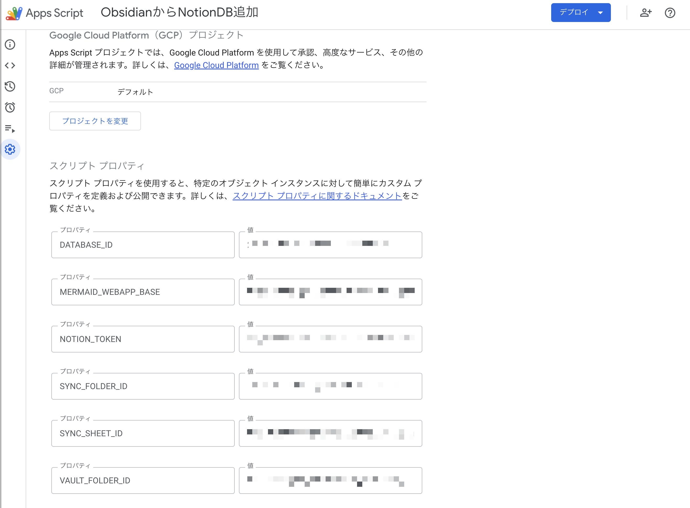
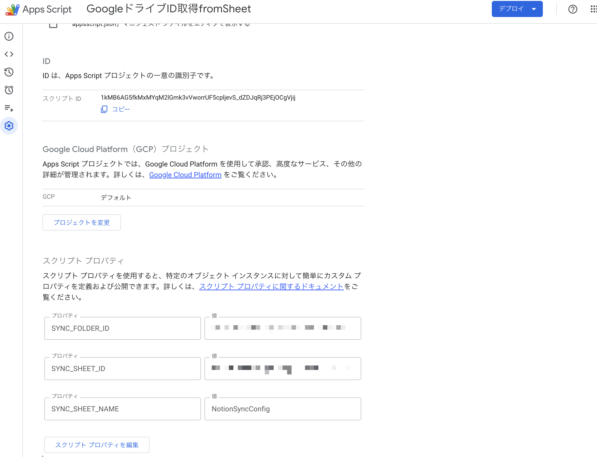
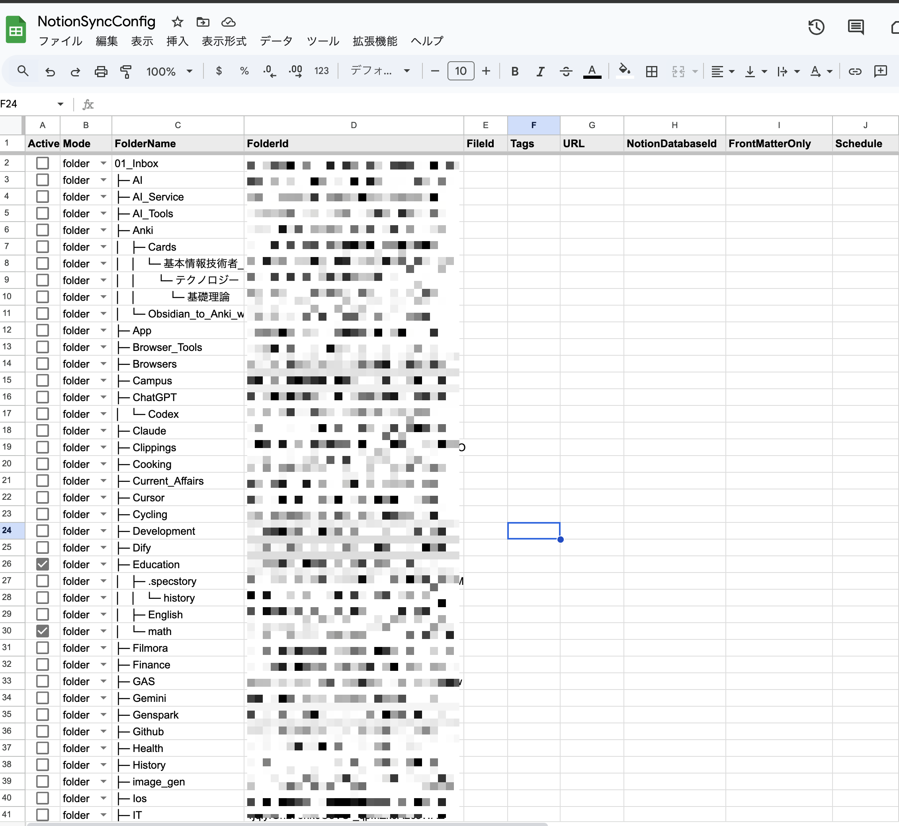
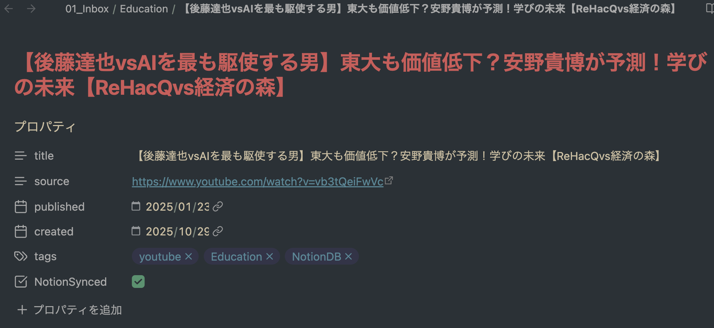

# Markdown to Notion

## 概要
Notion と Google Drive (Obsidian Vault 等) を同期するための Google Apps Script プロジェクトです。この README ではセットアップ方法と、同期対象を管理するためのハブスプレッドシートの使い方について説明します。

### 同期の流れ
1. 設定したルートフォルダ下にある全フォルダ名・IDを取得し、シートに転記
2. Active列をTRUEにしたフォルダが同期対象となる
3. さらに同期フラグがついた Markdownファイルが Notion へ同期される（NotionSynced/NotionDB タグなどの条件で同期）
4. 同期結果・時刻が `Status` / `LastSynced` に書き戻される
5. 同期されたMarkdown ファイルには自動で同期済みのフラグが付与される（front matter に `NotionSynced: true` を追記）

### 備考
- Markdown → Notion ブロックへの変換や、Notion テーブル・Mermaid・LaTeX といった拡張にも対応しています。youtube動画の埋め込みも対応しています。

---

## セットアップ

1. リポジトリを `clasp clone` または `git clone` で取得
2. `00_config_init.js` を `00_config.js` にリネーム
3. Apps Script の **プロジェクトのプロパティ → スクリプトのプロパティ** に以下のキーを登録  

| Key | Value | 備考 |
| --- | --- | --- |
| `NOTION_TOKEN` | Notion API token | 取得したシークレット |
| `DATABASE_ID` | 既定で同期する Notion DB ID | 行ごとに `NotionDatabaseId` が空ならこの値を使用 |
| `MERMAID_WEBAPP_BASE` | Mermaid を埋め込む Web アプリ URL | 既存の GAS Web アプリなど（後述参照） |
| `VAULT_FOLDER_ID` | 既定で同期する Drive フォルダ ID | シートで指定が無ければこのフォルダを同期 |
| `SYNC_SHEET_ID` | `NotionSyncConfig` シートの ID | ハブスプレッドシート |
| `SYNC_SHEET_NAME` | シート名 (例: `NotionSyncConfig`) | 任意 |

**実際の設定画面**


4. GAS に `clasp push` (または Apps Script editor で貼り付け)  
5. Notion 側で連携アプリに必要な DB へのアクセス権を付与

※ `00_config.js` は `.gitignore` 済みなので、公開リポジトリには含まれません。

### Mermaid Web アプリの用意

Mermaid コードブロックを Notion に埋め込むには、自前の Apps Script Web アプリを 1 つ用意し、その URL を `MERMAID_WEBAPP_BASE` に設定します。

1. [script.google.com](https://script.google.com) で新規プロジェクトを作成
2. `Code.gs` を全削除し、`99_mermaid_webapp.js` の内容を貼り付けて保存
3. メニュー `デプロイ > 新しいデプロイ` → 種別を `ウェブアプリ` に変更し、`実行するユーザー: 自分` / `アクセスできるユーザー: 全員（匿名可）` を選択してデプロイ
4. 表示された Web アプリ URL（例 `https://script.google.com/macros/s/.../exec`）を `MERMAID_WEBAPP_BASE` に設定する
5. ブラウザで `...?code=graph%20TD;A-->B;` を開き、Mermaid が描画されることを確認

デプロイ URL は Apps Script の再デプロイ時に変わることがあるため、更新後は Script Properties 側の `MERMAID_WEBAPP_BASE` も差し替えてください。

---

## ハブスプレッドシート

同期対象はスプレッドシート `NotionSyncConfig` で管理します。  
列構成（推奨）は以下の通りです。

| 列 | 説明 |
| --- | --- |
| `Active` | TRUE/FALSE (チェックボックス) |
| `FolderName` | 任意のメモ（表示用） |
| `FolderId` | 同期する Drive フォルダ ID |
| `Tags`, `URL` | Notion へ送るメタ情報（任意） |
| `NotionDatabaseId` | 空ならデフォルト DB、値があれば行ごとに別 DB を使用 |
| `Schedule` | 任意のメモ欄 |
| `LastSynced`, `Status` | GAS が書き込む同期履歴 |

> 以前存在した `Mode=file` / `FileId` による単発同期は廃止し、`FolderId` を単位とした同期のみをサポートしています。また `FrontMatterOnly` 列は未実装のため廃止しました。

### シートを自動生成する GAS

`createSyncConfigSheet()` を実行すると、上記構成のスプレッドシートを自動作成できます。  
（コード例は `docs/scripts/create_spreadsheet.js` にあります）


### テンプレシートの使用方法

1. [テンプレートシート](https://docs.google.com/spreadsheets/d/1x-oYjT-lcMjybAQPAUTk6FXzJfTam_YC8Mjj48BUZPQ/edit?usp=sharing)を開き、`ファイル → コピーを作成` で自分の Drive に複製し、名前を`NotionSyncConfig`に変更する


### 同期フォルダ名・IDの自動取得
1.Apps Script 側で以下のスクリプトプロパティを設定する

| Key | 説明 |
| --- | --- |
| `SYNC_FOLDER_ID` | フォルダ同期のデフォルト値（ルートフォルダID、https://drive.google.com/drive/folders/〇〇 の `〇〇` 部分）|
| `SYNC_SHEET_ID` | ハブシートのスプレッドシートID（テンプレートのスプレッドシートID、https://docs.google.com/spreadsheets/d/〇〇/edit?gid=0#gid=0 の `〇〇` 部分） |
| `SYNC_SHEET_NAME` | シート名（テンプレートのシート名、通常`NotionSyncConfig`） |

**実際の設定画面**


2.`フォルダ同期実行`ボタンをクリックするとルートフォルダ下にある全フォルダ名・IDを取得し、シートに転記します。


**実行後のイメージ（シート名は`NotionSyncConfig`、`Status`列は空）**


---

## Markdown 側の同期フラグ設定
### Obsidian の場合



### front matter の例(YAML生テキスト)
```markdown
---
title: 【後藤達也vsAIを最も駆使する男】東大も価値低下？安野貴博が予測！学びの未来【ReHacQvs経済の森】
source: https://www.youtube.com/watch?v=vb3tQeiFwVc
published: 2025-01-23
created: 2025-10-29
tags:
  - youtube
  - Education
  - NotionDB
NotionSynced: true
---
```

### フラグの説明
- `NotionDB` タグ
  front matter の `tags` に `NotionDB` を含める、または本文に `#export:notion` を記述するとNotionへの同期対象になります。Obsidian などでタグ管理している場合の切り分けに便利です。

- `NotionSynced`
   GAS によって マークダウンファイルが Notion へ同期されると自動で`NotionSynced: true`が作成されます。再同期したい場合はこの行を削除するか `false` に戻してください（後からマークダウンファイルを更新して反映させたい場合など）。Obsidian の場合は✅を外すと再同期されます。
  ※現在は Notion Search API (最大100件) でタイトル一致を探しており、検索結果にヒットしなかった場合は新しいページが作成されます。既存ページを確実に置き換えたい場合は、Notion 側で該当ページを削除してから同期してください。

---
## 同期の流れ

1. シートの `Active` を ON にしたフォルダが同期対象となる。90_runners.js の `syncMarkedFilesFromSheet()` を実行すると、行ごとに指定フォルダの同期処理が走る 
   - Vault 配下の Markdown を走査し、NotionSynced/NotionDB タグなどの条件で同期
3. 同期結果・時刻が `Status` / `LastSynced` に書き戻される

---

## 既知の機能

- Markdown → Notion ブロック変換（見出し、リスト、LaTeX、Mermaid、引用 etc.）
- テーブル：環境が許せば table/table_row を API から投稿、非対応環境では Markdown コードにフォールバック
- NotionSynced フラグの自動付与（front matter に `NotionSynced: true` を追記）
- ハブスプレッドシートから複数フォルダをまとめて同期
---


